# Idea to Launch

> A method, and an installable Claude Code skill, for taking a product from idea to go-live with a product manager (PM) who decides and an AI that builds.

Most "build it with AI" stories stop at the code. This method covers the whole path: validating the idea, listening to the market, brand, UX, a landing page that collects real sign-ups, the MVP, the store launch, and what comes after. The PM never writes code. The PM's job is the one that decides whether AI delivery works: clear goals, verifiable acceptance criteria, product decisions and QA.

It was built and tested end to end on [Byrnit](https://github.com/eugeniozamora/case-study-vent-journal-app), a privacy-first journaling app now live on [Google Play](https://play.google.com/store/apps/details?id=com.byrnit.byrnit).

---

## The problem it solves

AI can build a lot, but every conversation starts with no memory. Over weeks of work that becomes the real bottleneck: repeated debates, lost decisions, and sessions that start by re-learning the project. This method makes a cold start cost nothing:

- **One source of truth.** A single `MASTER_PLAN.md` holds the goal, the locked decisions and their reasons, the stages and the current state.
- **The same open and close ritual every session.** Open: read the state, propose a plan. Close: update the state and log the decisions. A session that doesn't update the plan didn't happen.
- **Verifiable criteria.** Every task is written as `[action] → verify: [check]`, so it can be checked by someone who didn't do it.
- **Small, vertical, tested.** The MVP ships as thin end-to-end slices, test first, with PM QA after each one.

## The 8 stages

```mermaid
flowchart LR
    S1["1 · Ideation<br/>product statement<br/>moat thesis"] --> S2["2 · Market listening<br/>real quotes"]
    S2 --> G1{{"go / no-go"}}
    G1 --> S3["3 · Positioning<br/>& brand"]
    S3 --> S4["4 · UX/UI<br/>flows · tokens<br/>prototype"]
    S4 --> S4B["4B · Landing<br/>+ waitlist"]
    S4B --> G2{{"go / no-go"}}
    G2 --> S5["5 · MVP<br/>vertical slices + TDD"]
    S5 --> S6["6 · Launch"]
    S6 --> S7["7 · Analytics"]
    S7 --> S8["8 · Growth<br/>& iteration"]
    S8 -. "data → change → measure" .-> S5
```



Each stage has the same template: objective, key decisions, deliverables, "done when", and the PM/Claude split. See [`references/stages.md`](skills/idea-to-launch/references/stages.md).

## Who does what

| PM (human) | Claude |
|---|---|
| Sets goals and acceptance criteria | Architecture, code and tests |
| Makes product decisions | Drafts copy, assets and docs |
| Runs QA in a real environment | Analysis with a recommendation |
| Owns accounts, money, publishing, outreach | Proposes, never decides product questions |

## Install the skill

In Claude Code:

```
/plugin marketplace add eugeniozamora/idea-to-launch
/plugin install idea-to-launch@idea-to-launch
```

Then start a project with the kickoff prompt in [`PROMPTS.md`](PROMPTS.md), or just describe your idea and say you want to build it with this method. After that, "open the session" and "close the session" are all you need day to day.

The skill orchestrates rather than duplicates: at each step it hands off to the specialised skill if you have it installed (brainstorming, planning, TDD, debugging, code review), and does the step inline if you don't.

## What's inside

```
skills/idea-to-launch/
├── SKILL.md                    how Claude runs the method: modes, rituals, criteria, slices
├── references/
│   ├── methodology.md          the full method and the reasoning behind it
│   ├── stages.md               the 8 stages in detail
│   └── decisions.md            how to record locked, parked, booked and reversed decisions
└── templates/
    ├── MASTER_PLAN.md          blank source-of-truth plan
    ├── LOG.md                  session log, newest first
    └── CLAUDE.md               project instructions skeleton
PROMPTS.md                      ready-to-paste prompts
```

Released under the [MIT License](LICENSE).

## Lessons built in

The method was refined by running it on a real launch, and the skill applies the corrections by default. The honest ones matter most:

- **Split the log from the plan on day 1.** Ours grew to ~460 lines inside the plan and stopped fitting in one read.
- **Log decisions, not implementation.** Git already records the code.
- **Use a team git flow from the start.** Switching later caused a direct-to-`main` slip.
- **Put validation gates early.** Byrnit launched with zero independent user feedback. That was acceptable for a learning-first project and would be a serious risk for a B2B product, so the skill now puts go/no-go gates at Stages 2 and 4B.

**Scope note:** Stages 1–6 were run in full on Byrnit. Stages 7 (analytics) and 8 (growth) are defined but haven't yet been run to completion.

Read the full reasoning in [`methodology.md`](skills/idea-to-launch/references/methodology.md).

---

## About

Built by Eugenio Zamora, fractional and interim engineering manager and technical consultant. I use this method as a lab to stay hands-on with how AI changes product delivery, and I help teams adopt it.

**[Book a meeting](https://calendar.app.google/5FeUeC4X1VBYt2bU6)** · [eugeniozamora.com](https://eugeniozamora.com) · [LinkedIn](https://www.linkedin.com/in/eugeniozamora/) · [Portfolio](https://github.com/eugeniozamora)
